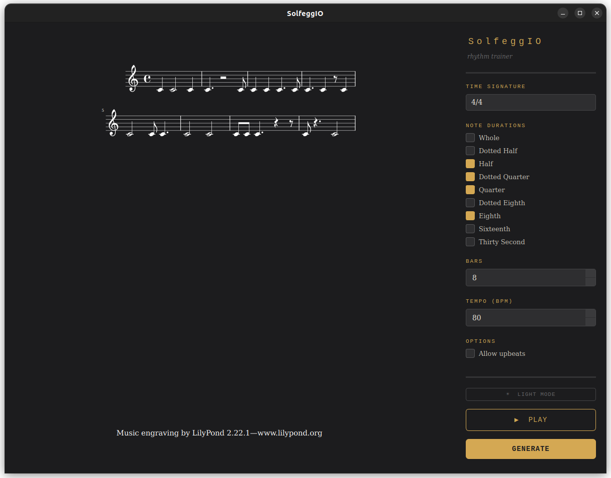
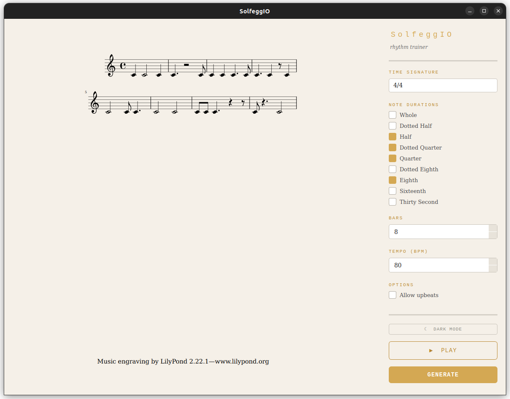

# SolfeggIO


[](https://github.com/ludocavalieri/solfeggio/actions/workflows/build.yml)

A rhythm training desktop app for music students. SolfeggIO generates random rhythms based on your settings, renders them as proper music notation, and plays them back with a metronome so you can train your ear and sight-reading at your own pace.

Dark Mode                  |  Light Mode
:-------------------------:|:-------------------------:
 |  

**Settings panel (right sidebar):**
| Setting | Description |
|---|---|
| Time Signature | Choose from common time signatures (4/4, 3/4, 6/8, etc.) |
| Note Durations | Select which note and rest lengths to include |
| Bars | Number of bars to generate (1–16) |
| Tempo (BPM) | Playback speed in beats per minute (40–200) |
| Allow upbeats | Whether notes can start on offbeats |

**Buttons:**
- **GENERATE** — creates a new random rhythm and renders it as notation
- **▶ PLAY** — plays back the rhythm with a metronome count-in (click again to stop)
- **☀ / ☾** — toggle between light and dark mode

## Using the App

### Option A: Download the executable (recommended for most users)
 
1. Download the latest release for your platform from the [Releases page](https://github.com/ludocavalieri/solfeggio/releases)
2. Launch it — everything is bundled, no installation required!
 
> [!NOTE]
> First-time launch on macOS and Windows may require a one-time security confirmation. See [macOS Notes](#-macos-notes) and [Windows Notes](#-windows-notes) below.

**macOS Notes**
 
macOS will block the executable on first launch since it hasn't been signed by an Apple-registered developer. To open it:
 
1. Double-click `SolfeggIO-macos` — you'll see a warning dialog
2. Go to **System Settings** → **Privacy & Security**
3. Scroll down — you'll see a message about SolfeggIO being blocked
4. Click **Open Anyway** and confirm
 
You only need to do this once. Alternatively, from the terminal:
 
```bash
xattr -dr com.apple.quarantine SolfeggIO-macos
chmod +x SolfeggIO-macos
./SolfeggIO-macos
```
 
**Windows Notes**
 
Windows SmartScreen may block the executable on first launch. To open it:
 
1. Double-click `SolfeggIO-windows.exe`
2. Click **More info** in the blue dialog that appears
3. Click **Run anyway**
 
You only need to do this once.

### Option B: Run from source (recommended for developers)

#### Prerequisites

Before running SolfeggIO, you need the following installed on your system:

**Python 3.10+**
Check your version with:
```bash
python3 --version
```

**LilyPond**
SolfeggIO uses LilyPond to render music notation. Install it with:
```bash
# Linux
sudo apt install lilypond

# macOS
brew install lilypond

# Windows
# Download the installer from https://lilypond.org/download.html
```

#### Installation

1. Clone the repository:
```bash
git clone https://github.com/ludovica-cavalieri/solfeggio.git
cd solfeggio
```

2. Create and activate a virtual environment:
```bash
python3 -m venv .venv
source .venv/bin/activate      # macOS/Linux
.venv\Scripts\activate         # Windows
```

3. Install dependencies:
```bash
pip install -r requirements.txt
```

#### Launching the App

Launch SolfeggIO with:
```bash
python3 app.py
```

## Future Additions

- Handle edge cases where no valid rhythm exists for a given duration combination
- Export rhythm as PDF or image

## Contributing

Contributions are welcome! Feel free to open an issue or submit a pull request. For major changes, please open an issue first to discuss what you'd like to change.

Please make sure any changes to the core modules still pass the existing tests before submitting.

## Author

**Ludovica Cavalieri**
[ludovica.cavalieri@uniroma1.it](mailto:ludovica.cavalieri@uniroma1.it)

## License

This project is licensed under the MIT License — see [LICENSE](LICENSE) for details.